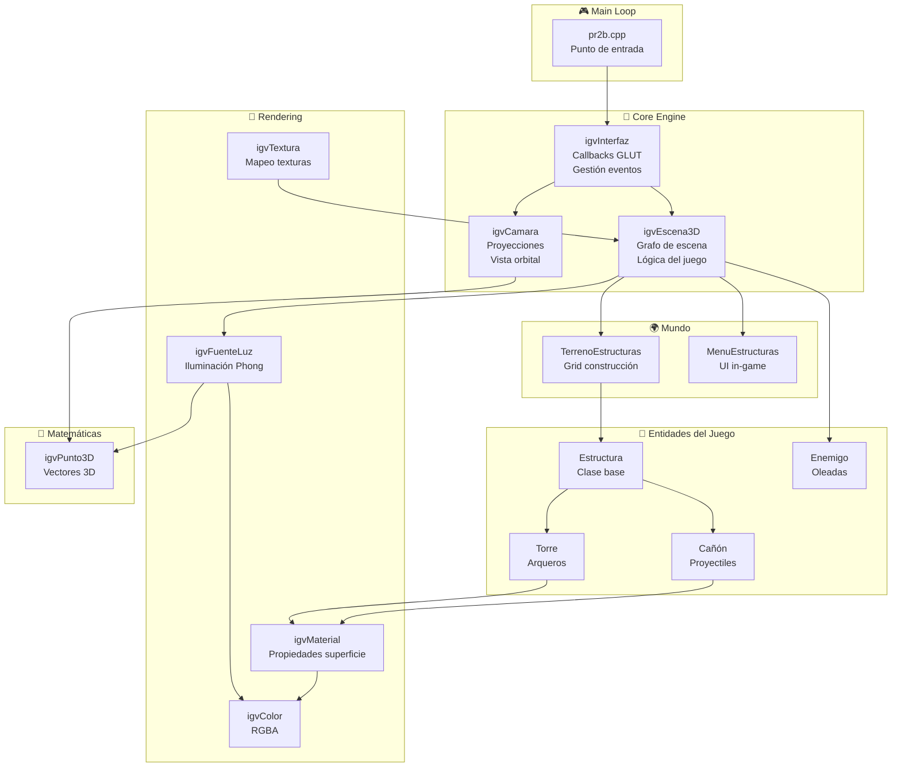
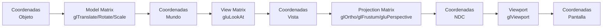

<p align="center">
  
  
  
  
  
</p>

<h1 align="center">🏰 Tower Defense 3D - OpenGL</h1>
<h3 align="center">Videojuego de Estrategia en Tiempo Real con Gráficos 3D</h3>

<p align="center">
  <strong>Proyecto Académico de Informática Gráfica y Visualización (IGV)</strong>
</p>

---

## 📋 Tabla de Contenidos

- [🎯 Propósito del Proyecto](#-propósito-del-proyecto)
- [🎮 Descripción del Juego](#-descripción-del-juego)
- [🛠️ Tech Stack](#️-tech-stack)
- [📦 Instalación y Compilación](#-instalación-y-compilación)
- [🚀 Quick Start](#-quick-start)
- [🎮 Controles del Juego](#-controles-del-juego)
- [🏗️ Arquitectura del Sistema](#️-arquitectura-del-sistema)
- [📊 Diagrama de Clases UML](#-diagrama-de-clases-uml)
- [🔧 Core Logic: Motor Gráfico](#-core-logic-motor-gráfico)
- [📂 Estructura del Proyecto](#-estructura-del-proyecto)
- [🎨 Sistema de Renderizado](#-sistema-de-renderizado)
- [📷 Sistema de Cámara](#-sistema-de-cámara)
- [💡 Sistema de Iluminación](#-sistema-de-iluminación)
- [🎵 Sistema de Audio](#-sistema-de-audio)
- [🎬 Demostración](#-demostración)

---

## 🎯 Propósito del Proyecto

> **¿Qué problema resuelve?**

Este proyecto implementa un **videojuego Tower Defense 3D completo** diseñado para demostrar el dominio de:

| Concepto | Implementación |
|----------|----------------|
| **Renderizado 3D** | Pipeline OpenGL con transformaciones matriciales |
| **Sistemas de Cámara** | Proyección paralela, frustum y perspectiva con órbita |
| **Iluminación Avanzada** | Modelo Phong con múltiples fuentes de luz y focos |
| **Gestión de Escenas** | Grafo de escena con jerarquía de objetos |
| **Interacción Usuario** | Eventos GLUT con selección de objetos por color-picking |
| **Animación en Tiempo Real** | Sistema de idle functions para animaciones fluidas |

El jugador debe **defender a los reyes** de oleadas de enemigos construyendo torres arqueras y cañones estratégicamente ubicados en el terreno.

---

## 🎮 Descripción del Juego

### 🎲 Mecánicas Principales

```
┌─────────────────────────────────────────────────────────────────┐
│                    TOWER DEFENSE 3D                             │
├─────────────────────────────────────────────────────────────────┤
│  • Construye TORRES ARQUERAS 🏹 y CAÑONES 💣                   │
│  • Defiende a los REYES 👑 de las oleadas de enemigos          │
│  • Gestiona tu ECONOMÍA 💰 (dinero limitado)                   │
│  • Mejora y vende estructuras según la estrategia              │
│  • Sobrevive todas las oleadas para ganar 🏆                   │
└─────────────────────────────────────────────────────────────────┘
```

### 🎯 Objetivo
Proteger a los reyes colocando estructuras defensivas de forma estratégica. Cada enemigo que alcanza a los reyes resta vidas. El juego termina cuando:
- **Victoria**: Se eliminan todos los enemigos de todas las oleadas
- **Derrota**: Los reyes pierden todas sus vidas

---

## 🛠️ Tech Stack

| Tecnología | Versión | Propósito |
|------------|---------|-----------|
| **C++** | C++11+ | Lenguaje principal |
| **OpenGL** | 2.1+ | API gráfica para renderizado 3D |
| **GLUT/freeglut** | 2.8+ | Gestión de ventanas y eventos |
| **GLU** | 1.3+ | Utilidades OpenGL (perspectiva, lookAt) |
| **SDL2_image** | 2.0+ | Carga de texturas PNG |
| **Windows API** | - | Reproducción de audio (PlaySound) |

### 📚 Dependencias Clave

```cpp
// Renderizado
#include <GL/glut.h>
#include <GL/glu.h>

// Texturas
#include <SDL_image.h>

// Audio (Windows)
#include <playsoundapi.h>
```

---

## 📦 Instalación y Compilación

### 📋 Prerrequisitos

<details>
<summary><strong>Windows (Visual Studio)</strong></summary>

1. **Visual Studio 2019+** con soporte C++
2. **freeglut** - Descargar de [freeglut.sourceforge.net](http://freeglut.sourceforge.net/)
3. **SDL2 + SDL2_image** - Descargar de [libsdl.org](https://www.libsdl.org/)

```powershell
# Configurar rutas de include y lib en Visual Studio:
# - freeglut/include → C/C++ > Additional Include Directories
# - freeglut/lib → Linker > Additional Library Directories
# - SDL2/include, SDL2_image/include → C/C++ > Additional Include Directories
```

**Librerías a enlazar:**
```
opengl32.lib
glu32.lib
freeglut.lib
SDL2.lib
SDL2_image.lib
winmm.lib  # Para PlaySound
```

</details>

<details>
<summary><strong>macOS</strong></summary>

```bash
# Instalar dependencias con Homebrew
brew install freeglut sdl2 sdl2_image

# Compilar
g++ -std=c++11 -o TowerDefense Codigo/*.cpp \
    -framework OpenGL -framework GLUT \
    -I/usr/local/include -L/usr/local/lib \
    -lSDL2 -lSDL2_image
```

</details>

### 🔨 Compilación

```bash
# Desde el directorio Codigo/
# Windows (Visual Studio Developer Command Prompt)
cl /EHsc /I"path/to/includes" pr2b.cpp *.cpp /link opengl32.lib glu32.lib freeglut.lib SDL2.lib SDL2_image.lib winmm.lib

# O abrir el proyecto en Visual Studio y compilar (F7)
```

---

## 🚀 Quick Start

```bash
# 1. Clonar el repositorio
git clone https://github.com/tu-usuario/Videojuego-OpenGL.git
cd Videojuego-OpenGL

# 2. Abrir en Visual Studio
# Archivo > Abrir > Carpeta > Seleccionar "Codigo"

# 3. Configurar dependencias (ver sección anterior)

# 4. Ejecutar (F5)
```

**Ventana inicial:** `500x500 píxeles` en posición `(100, 100)`

---

## 🎮 Controles del Juego

### ⌨️ Teclado

| Tecla | Acción |
|-------|--------|
| `A` | Activar/Desactivar animación |
| `T` | Abrir tienda de estructuras |
| `R` | Reiniciar partida |
| `1` | Vista panorámica (original) |
| `2` | Vista alzado |
| `3` | Vista planta |
| `4` | Vista perfil |
| `0` | Dividir pantalla en 4 vistas |
| `+` / `-` | Zoom in/out |
| `P` | Cambiar a proyección paralela |
| `F` | Cambiar a proyección frustum |
| `E` | Cambiar a proyección perspectiva |
| `L` | Activar/Desactivar iluminación |
| `ESC` | Salir del juego |

### 🖱️ Ratón

| Acción | Función |
|--------|---------|
| **Clic izquierdo** | Seleccionar terreno/estructura |
| **Arrastrar** | Rotar cámara orbital |
| **Clic derecho** | Menú contextual (construir/mejorar/vender) |

---

## 🏗️ Arquitectura del Sistema



---

## 📊 Diagrama de Clases UML

El proyecto incluye un diagrama UML completo que muestra las relaciones entre todas las clases:


### 🔗 Relaciones Principales

| Relación | Descripción |
|----------|-------------|
| `Torre` → `Estructura` | Herencia pública |
| `Cañón` → `Estructura` | Herencia pública |
| `igvEscena3D` ◇→ `igvFuenteLuz` | Composición (múltiples luces) |
| `igvEscena3D` ◇→ `TerrenoEstructuras` | Composición |
| `igvInterfaz` ◇→ `igvEscena3D` | Composición |
| `igvInterfaz` ◇→ `igvCamara` | Composición |

---

## 🔧 Core Logic: Motor Gráfico

### 📐 Sistema de Transformaciones

El motor implementa la **pipeline clásica de OpenGL** con transformaciones matriciales:



### 🎯 Algoritmo de Selección (Color Picking)

```cpp
// Modo selección: cada objeto se renderiza con color único
modoInterfaz modo = seleccionar;

// Obtener color del píxel bajo el cursor
GLubyte pixel[3];
glReadPixels(x, y, 1, 1, GL_RGB, GL_UNSIGNED_BYTE, pixel);

// Mapear color a ID de objeto
int terrenoID = buscarTerreno(pixel);
int torreID = buscarTorre(pixel);
```

### ⏱️ Sistema de Animación

El juego utiliza **callbacks idle** para animaciones independientes:

```cpp
// Animaciones paralelas
static void reyIdleFunc();        // Movimiento de reyes
static void enemigoIdleFunc();    // Movimiento de enemigos
static void balaCañonIdleFunc();  // Proyectiles de cañón
static void flechaTorreIdleFunc(); // Flechas de torre
```

---

## 📂 Estructura del Proyecto

```
Videojuego-OpenGL/
├── 📁 Codigo/                      # Código fuente C++
│   ├── 📄 pr2b.cpp                 # ⭐ Punto de entrada (main)
│   │
│   ├── 🎮 CORE ENGINE
│   │   ├── 📄 igvInterfaz.cpp/h    # Gestión ventana + eventos GLUT
│   │   ├── 📄 igvEscena3D.cpp/h    # Escena 3D + lógica del juego
│   │   └── 📄 igvCamara.cpp/h      # Sistema de cámara multi-vista
│   │
│   ├── 🎨 RENDERIZADO
│   │   ├── 📄 igvFuenteLuz.cpp/h   # Iluminación (hasta 8 luces)
│   │   ├── 📄 igvMaterial.cpp/h    # Materiales Phong
│   │   ├── 📄 igvTextura.cpp/h     # Carga y aplicación texturas
│   │   └── 📄 igvColor.cpp/h       # Colores RGBA
│   │
│   ├── 🏰 ENTIDADES
│   │   ├── 📄 Estructura.cpp/h     # Clase base estructuras
│   │   ├── 📄 Torre.cpp/h          # Torre arquera (hereda Estructura)
│   │   ├── 📄 Cañon.cpp/h          # Cañón (hereda Estructura)
│   │   └── 📄 Enemigo.cpp/h        # Enemigos por oleada
│   │
│   ├── 🌍 MUNDO
│   │   ├── 📄 TerrenoEstructuras.cpp/h  # Grid de construcción
│   │   └── 📄 MenuEstructuras.cpp/h     # Menú in-game
│   │
│   └── 📐 MATEMÁTICAS
│       └── 📄 igvPunto3D.cpp/h     # Puntos/vectores 3D
│
├── 📁 Extras/                      # Recursos adicionales
│   ├── 🎵 Cañon.wav               # Sonido disparo cañón
│   ├── 🎵 Flecha.wav              # Sonido disparo flecha
│   ├── 🎵 Muerte.wav              # Sonido muerte enemigo
│   ├── 🎵 Victoria.wav            # Sonido victoria
│   ├── 🎵 Derrota.wav             # Sonido derrota
│   ├── 🖼️ cesped.png              # Textura terreno
│   ├── 📊 Diagrama UML.png        # Diagrama de clases
│   └── 📄 ClassDiagram.cd         # Archivo diagrama VS
│
├── 📄 README.md                    # Este archivo
├── 📄 DOCUMENTACIÓN PROYECTO.pdf   # Documentación académica
└── 🎬 VideoProyectoIGV.avi        # Demostración en video
```

---

## 🎨 Sistema de Renderizado

### 🖼️ Primitivas Utilizadas

El juego construye modelos 3D usando primitivas GLUT:

| Primitiva | Uso |
|-----------|-----|
| `glutSolidCube()` | Estructuras, terreno, murallas |
| `glutSolidCone()` | Puntas de torres, flechas |
| `glutSolidSphere()` | Proyectiles, decoración |

### 🎭 Modos de Visualización

```cpp
// Cambio dinámico modo fill/wireframe
if (modoVisualizacion == SOLIDO)
    glPolygonMode(GL_FRONT_AND_BACK, GL_FILL);
else
    glPolygonMode(GL_FRONT_AND_BACK, GL_LINE);
```

### ✨ Efectos Visuales

- **Double Buffering**: Previene parpadeo (`glutSwapBuffers()`)
- **Z-Buffer**: Oclusión correcta (`GL_DEPTH_TEST`)
- **Normales Automáticas**: Para iluminación correcta

---

## 📷 Sistema de Cámara

### 🔭 Tipos de Proyección

```cpp
typedef enum {
    IGV_PARALELA,     // Ortográfica - para vistas técnicas
    IGV_FRUSTUM,      // Frustum - perspectiva manual
    IGV_PERSPECTIVA   // gluPerspective - perspectiva automática
} tipoCamara;
```

### 👁️ Vistas Múltiples

```cpp
typedef enum {
    ORIGINAL,  // Vista panorámica 3D
    ALZADO,    // Vista frontal (XY)
    PLANTA,    // Vista superior (XZ)
    PERFIL     // Vista lateral (YZ)
} tipoVista;
```

### 🔄 Cámara Orbital

```cpp
void igvCamara::orbital(float valX, float valY) {
    camera_angle_x += valX;
    camera_angle_y += valY;
    
    // Conversión esférica a cartesiano
    float _x = 5.0f * sin(camera_angle_x * PI / 180.0f);
    float _y = 5.0f * sin(camera_angle_y * PI / 180.0f);
    float _z = 5.0f * cos(camera_angle_x * PI / 180.0f);
    
    P0 = igvPunto3D(_x, _y, _z);
}
```

---

## 💡 Sistema de Iluminación

### 🎚️ Parámetros de Fuente de Luz

```cpp
class igvFuenteLuz {
    unsigned int idLuz;        // GL_LIGHT0 a GL_LIGHT7
    igvPunto3D posicion;       // Posición en el mundo
    
    // Componentes de color
    igvColor colorAmbiente;
    igvColor colorDifuso;
    igvColor colorEspecular;
    
    // Atenuación: 1/(a0 + a1*d + a2*d²)
    double aten_a0, aten_a1, aten_a2;
    
    // Para focos (spotlights)
    igvPunto3D direccion_foco;
    double angulo_foco;
    double exponente_foco;
};
```

### 💎 Materiales

```cpp
class igvMaterial {
    igvColor ambiente;      // Reflectancia ambiental
    igvColor difuso;        // Reflectancia difusa
    igvColor especular;     // Reflectancia especular
    double exponente;       // Shininess (brillo)
};
```

---

## 🎵 Sistema de Audio

El juego incluye efectos de sonido para mayor inmersión:

| Evento | Archivo | Descripción |
|--------|---------|-------------|
| Disparo Cañón | `Cañon.wav` | Al disparar un cañón |
| Disparo Flecha | `Flecha.wav` | Al disparar una torre |
| Muerte Enemigo | `Muerte.wav` | Al eliminar un enemigo |
| Victoria | `Victoria.wav` | Al ganar el nivel |
| Derrota | `Derrota.wav` | Al perder todas las vidas |

```cpp
void igvInterfaz::reproducirSonido(tipoSonido sonido) {
    switch(sonido) {
        case DISPAROCAÑON:
            PlaySound("Extras/Cañon.wav", NULL, SND_ASYNC);
            break;
        // ... otros casos
    }
}
```

---

## 🎬 Demostración

El proyecto incluye un video demostrativo completo:

📹 **[VideoProyectoIGV.avi](VideoProyectoIGV.avi)** - Demostración del gameplay y características

### 📸 Características Demostradas

- ✅ Construcción de torres y cañones
- ✅ Sistema de oleadas de enemigos
- ✅ Disparos automáticos con animación
- ✅ Múltiples vistas de cámara
- ✅ Iluminación dinámica
- ✅ Interfaz de usuario integrada

---

## 📝 Documentación Adicional

Para información más detallada sobre la implementación, consultar:

📄 **[DOCUMENTACIÓN PROYECTO DE IGV.pdf](DOCUMENTACIÓN%20PROYECTO%20DE%20IGV.pdf)**

---

<p align="center">
  <strong>Proyecto desarrollado para la asignatura de Informática Gráfica y Visualización</strong>
</p>

<p align="center">
  <sub>Built with ❤️ using OpenGL and C++</sub>
</p>